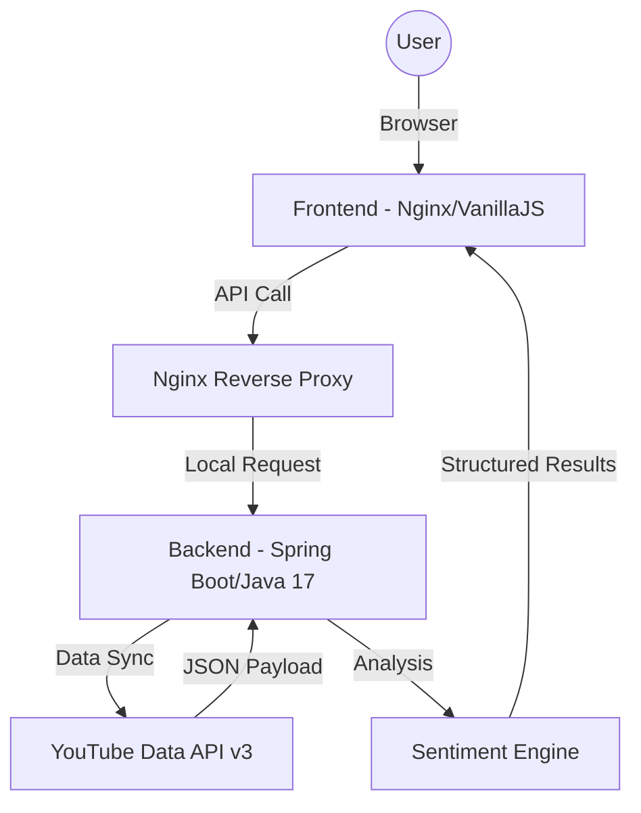

# 🔍 YouTube Comment Discovery & Analysis

> **Elevate your YouTube research with high-fidelity comment extraction and AI-driven sentiment insights.**

---

## 🚀 Project Overview

**YouTube Comment Discovery** is a modular, full-stack application designed to streamline the pipeline from raw social data to actionable insights. By leveraging the **YouTube Data API v3**, it extracts deep comment threads and summarizes audience sentiment using a specialized Java-based analysis engine.

### ✨ Key Features
- ⚡ **High-Speed Extraction**: Fetch up to 500+ comments including nested replies in seconds.
- 📊 **AI Insights Dashboard**: Real-time visualization of Sentiment Distribution (Positive, Neutral, Negative).
- 🛡️ **Toxicity Monitoring**: Integrated safety metrics to identify high-risk comment sections.
- 🐳 **One-Click Deployment**: Fully containerized with Docker and Docker Compose for instant setup.
- 📱 **Premium UI**: Modern, glassmorphism-based interface built with Vanilla JS and CSS for maximum responsiveness.

---

## 🛠️ Technology Stack

| Component | Technology | Description |
| :--- | :--- | :--- |
| **Backend** |   | RESTful API & Extraction Engine |
| **Frontend** |   | Reactive Discovery Interface |
| **Infrastructure** |   | Orchestration & Reverse Proxy |
| **API** |  | Data Source |

---

## 🏗️ System Architecture



---

## ⚡ Quick Start

### 1. Prerequisites
- **Docker Desktop** installed and running.
- A **YouTube Data API Key** (Get one at [Google Cloud Console](https://console.cloud.google.com/)).

### 2. Configuration
Create a `.env` file in the `infra/` directory (refer to `.env.example` if available) and add your key:
```bash
YOUTUBE_API_KEY=your_actual_key_here
```

### 3. Launching
#### **Option A: One-Click Docker (Recommended)**
Double-click `DOCKER_START.bat` in the root directory. This script will:
1. Verify Docker availability.
2. Build the backend and frontend containers.
3. Launch the application at `http://localhost:3000`.

#### **Option B: Local Native (Dev Mode)**
Double-click `DEV_START.bat`. Requires Java 17 and Python (for local static serving).

---

## 📜 Documentation
- 📘 **[TECHNICAL_REPORT.md](docs/TECHNICAL_REPORT.md)**: Deep dive into the Sentiment Extraction algorithms.
- 📙 **[OPERATIONS_GUIDE.md](docs/OPERATIONS_GUIDE.md)**: Advanced deployment, scaling, and troubleshooting.

---

## 📄 License
Distributed under the **MIT License**. See `LICENSE` for more information.

---
*Built with ❤️ for the Java Developer Community.*


